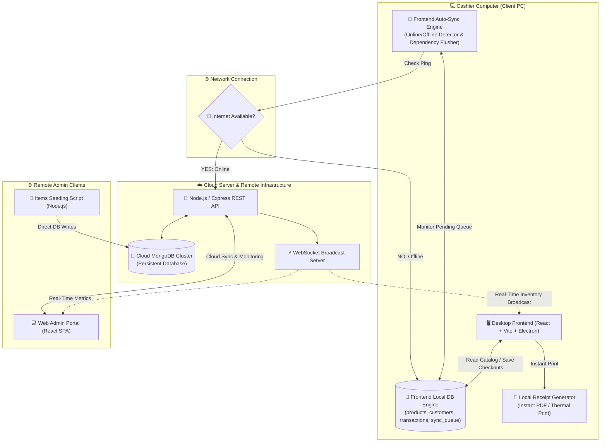
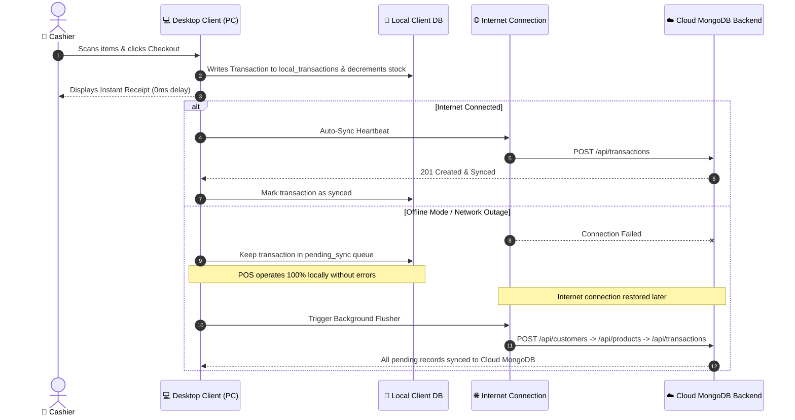

# 📐 Xona POS System Architecture

This document details the system design, network boundaries, database topology, offline resilience engine, and cloud auto-synchronization pipeline of the **Xona POS System**.

---

## 🏗️ System Overview & Network Topology

---

## 🔄 Offline & Cloud Auto-Sync Sequence Flow

---

## 🧱 Component Breakdown

### 1. Client PC Desktop Application (`desktop/`)
* **Technology**: React 19, Vite, Electron, Tailwind CSS, Lucide Icons, ECharts.
* **Role**: Runs directly on the cashier's computer. Manages UI registers, catalog search, receipt generation, and customer management.
* **Offline Resilience**: Features an embedded client database store (`offlineStore.ts`) that persists products, customers, transactions, and user credentials locally on disk.

### 2. Remote Cloud Infrastructure (`backend/`)
* **Technology**: Node.js, Express.js, Mongoose, WebSocket (`ws`).
* **Role**: Hosted on cloud infrastructure (e.g. AWS, Render, Heroku). Exposes REST endpoints for transactions, reporting, catalog management, and PDF generation.
* **Persistence**: Connects to a Cloud MongoDB cluster for permanent storage.

### 3. Web Admin Portal (`webapp/`)
* **Technology**: React 19, Vite, Tailwind CSS, Lucide Icons, ECharts.
* **Role**: A purely cloud-connected web application intended for remote monitoring by owners and system administrators.
* **Architecture**: Fully decoupled from local hardware (no offline database, no printers). Uses the same REST APIs as the desktop client but restricts mutations (like checkouts) to enforce a read-heavy monitoring workflow.

### 4. Items Seeding Backend (`items-backend/`)
* **Technology**: Node.js, Mongoose.
* **Role**: An isolated, lightweight utility script to batch insert or reset product catalogs directly into the MongoDB cluster.
* **Architecture**: Operates entirely independently of the Express API. Connects directly to the DB, runs the seed payload, and safely shuts down upon completion.

### 5. Sync Engine Pipeline
* **Dependency-Ordered Flushing**:
  1. **Customers First**: Syncs new customer profiles to generate valid Cloud IDs.
  2. **Products Second**: Syncs newly created/edited catalog items.
  3. **Transactions Third**: Syncs offline checkouts referencing valid customer and product IDs.
