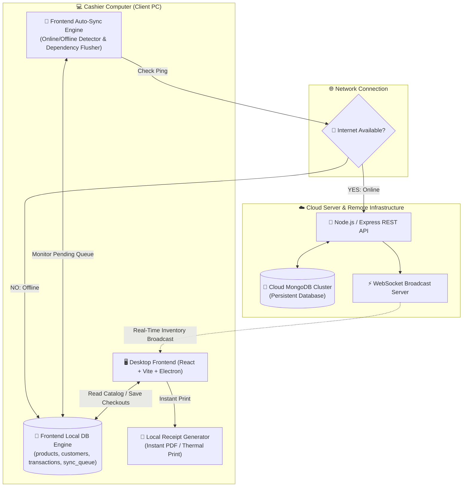
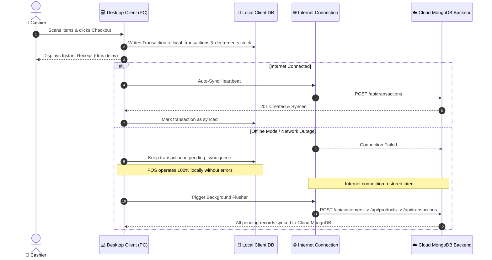

# 🛒 Xona POS System

Xona POS is a modern, high-performance, **offline-first Point of Sale (POS) system** built for retail management, fast checkout registers, inventory control, customer CRM, and analytical business reports.

It is designed with a **dual-layer architecture**: the Desktop Client runs **100% locally on the Cashier PC** with an embedded local database (`offlineStore.ts`) that guarantees 0-latency checkouts even when completely disconnected from the internet, while automatically synchronizing queued transactions, catalog updates, and customer profiles to a **Cloud MongoDB** cluster whenever online connectivity is active.

---

## 📐 System Architecture Diagram



---

## 🔄 Offline & Cloud Auto-Sync Workflow



---

## 📂 Repository Structure

* [backend/](./backend) — Node.js & Express.js REST API server powered by Mongoose for Cloud MongoDB persistence, local SQLite (`better-sqlite3`), background sync engine, PDF reporting, and recommendation graph traversals.
* [desktop/](./desktop) — React + Vite + Electron desktop client featuring an embedded client-side database, offline login fallback, Sinhala typography support (`Noto Sans Sinhala`), real-time sync status badge, and interactive POS registers.
* [database/](./database) — Comprehensive database schema documentation for users, products, customers, transactions, and co-occurrence graph relationships.

---

## ⚡ Key Features

* **🛒 Offline-First POS Register:** Fast product lookup, customer selection, cash payment handling, instant discount calculations, tax handling, and instant receipt printing. Operates 100% offline without requiring a local backend server.
* **🔄 Automatic Cloud Synchronization:** Background flusher that queues offline products, customers, and transactions locally, then uploads pending records to Cloud MongoDB in strict dependency order (Customers $\rightarrow$ Products $\rightarrow$ Transactions).
* **🔒 Seamless Offline Login:** Offline user credentials caching allows cashiers and admins to log in and operate the app even when disconnected from the internet.
* **⚡ Always Offline Mode Toggle:** Setting switch that forces the app to run strictly from local disk storage without issuing remote cloud network requests or error notifications.
* **📦 Catalog Management:** Full inventory CRUD controls, SKU management, stock tracking, price/cost adjustments, and product image uploads.
* **👥 Customer CRM:** Customer profile management and transaction association.
* **🕸️ Product Co-Occurrence Net:** Graph relationship visualization (powered by ECharts) highlighting items frequently purchased together using BFS & DFS graph algorithms.
* **🇱🇰 Multi-Language & Sinhala Typography:** Integrated Google Font `Noto Sans Sinhala` for proper Sinhala text shaping across all views, menus, and receipts.
* **🧾 Transaction & Audit Logs:** Detailed transaction history, line-item audit views, and instant refund processing with inventory reversal.
* **📊 Analytics & PDF Reports:** Comprehensive sales charts, top-selling product metrics, downloadable PDF sales reports, and complete database backup/restore capabilities.

---

## ⚙️ Configuration & Quick Start

Ensure you have **Node.js** (v18+) and **MongoDB** installed.

### 1. Backend Environment Setup
Inside the `backend/` directory, configure your `.env` file:

```env
PORT=3000
MONGO_URI=mongodb://127.0.0.1:27017/xona-pos
ADMIN_USERNAME=admin
ADMIN_PASSWORD=your_secure_password
```

### 2. Launch the Backend
Run the root helper command:
```powershell
.\run-backend.cmd
```
*Or manually:*
```bash
cd backend
npm install
npm run dev
```

### 3. Launch the Desktop Client
Run the root helper command:
```powershell
.\run-frontend.cmd
```
*Or manually:*
```bash
cd desktop
npm install
npm run dev
```

---

## 🖥️ Application Modules

* **Dashboard:** Real-time revenue metrics, transaction counts, Average Order Value (AOV), and top-selling product lists.
* **Checkout Register:** Cashier terminal with category filtering, instant cart calculations, customer selector, and product co-occurrence recommendation panel.
* **Products Catalog:** Inventory catalog manager supporting live search, price/stock updates, and image asset uploads.
* **Transactions:** Complete history log with search filters, transaction status badges, and one-click refund capabilities.
* **Co-Occurrence Net:** Interactive visual graph mapping connections between categories and items commonly purchased in single checkouts.
* **System Settings:** VAT tax rate configuration, Always Offline Mode toggle, Cloud Sync connection indicator, and English / Sinhala language switcher.
* **DB Maintenance:** Local Storage & Cloud MongoDB engine health monitors, local JSON backup export, and full database restore tools.
