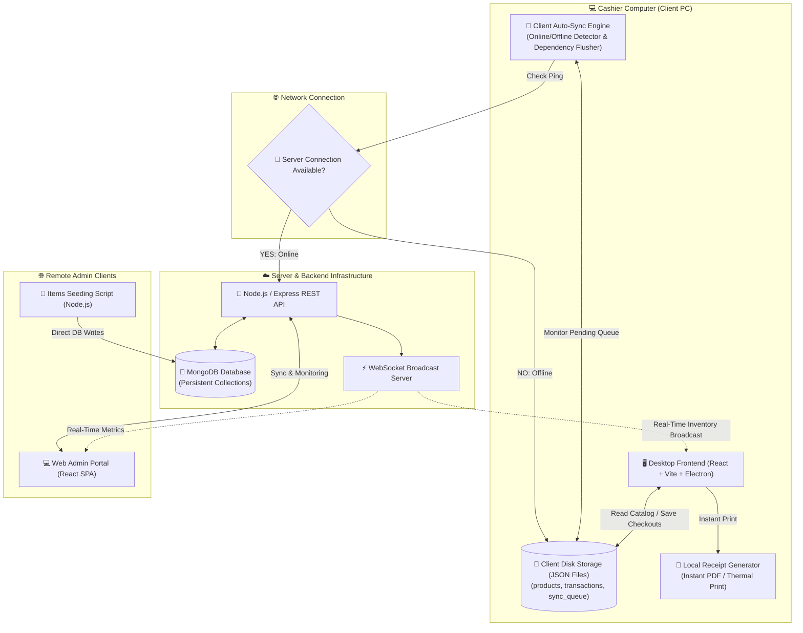
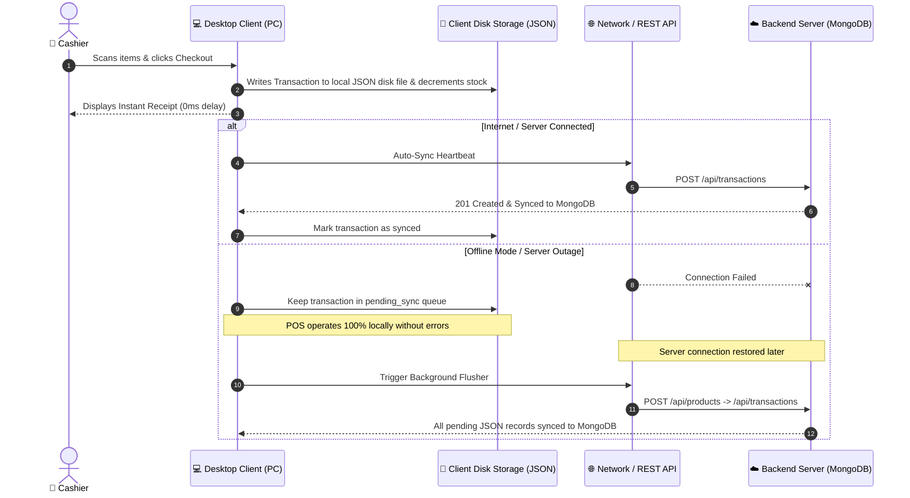

# 📐 Xona POS System Architecture

This document details the system design, network boundaries, database topology, offline resilience engine, and cloud auto-synchronization pipeline of the **Xona POS System**.

---

## 🏗️ System Overview & Network Topology

---

## 🔄 Offline & Cloud Auto-Sync Sequence Flow

---

## 🧱 Component Breakdown

### 1. Client PC Desktop Application (`desktop/`)
* **Technology**: React 19, Vite, Electron, Tailwind CSS, Lucide Icons, ECharts.
* **Role**: Runs directly on the cashier's computer. Manages UI registers, catalog search, and receipt generation.
* **Offline Resilience**: Features an embedded client database store (`offlineStore.ts`) that persists products, transactions, and user credentials locally on disk using dual-layer `localStorage` and `electronDB` disk files.

### 2. Backend Server (`backend/`)
* **Technology**: Node.js, Express.js, Mongoose, WebSocket (`ws`).
* **Role**: Exposes REST endpoints for transactions, reporting, catalog management, and PDF generation. Connects directly to MongoDB for persistence.
* **Persistence**: Pure MongoDB implementation via Mongoose models (`UserModel`, `ProductModel`, `TransactionModel`, `CustomerModel`, `GraphNodeModel`, `GraphEdgeModel`).

### 3. Web Admin Portal (`webapp/`)
* **Technology**: React 19, Vite, Tailwind CSS, Lucide Icons, ECharts.
* **Role**: A cloud-connected web application intended for remote monitoring by owners and system administrators.
* **Architecture**: Fully decoupled from local hardware (no offline database, no printers). Uses the same REST APIs as the desktop client.

### 4. Items Seeding Backend (`items-backend/`)
* **Technology**: Node.js, Mongoose.
* **Role**: An isolated, lightweight utility script to batch insert or reset product catalogs directly into the MongoDB database.

### 5. Security & Device Authentication
* **Strict CORS**: The Node.js Express server restricts browser origin requests to a whitelisted array defined in `.env` (e.g. `localhost:5173`).
* **API Key Interceptor**: Requiring an `x-api-key` header on all `/api/*` endpoints.

### 6. Client Sync Engine Pipeline
* **Dependency-Ordered Flushing**:
  1. **Products First**: Syncs newly created/edited catalog items.
  2. **Transactions Second**: Syncs offline checkouts referencing valid product IDs.
