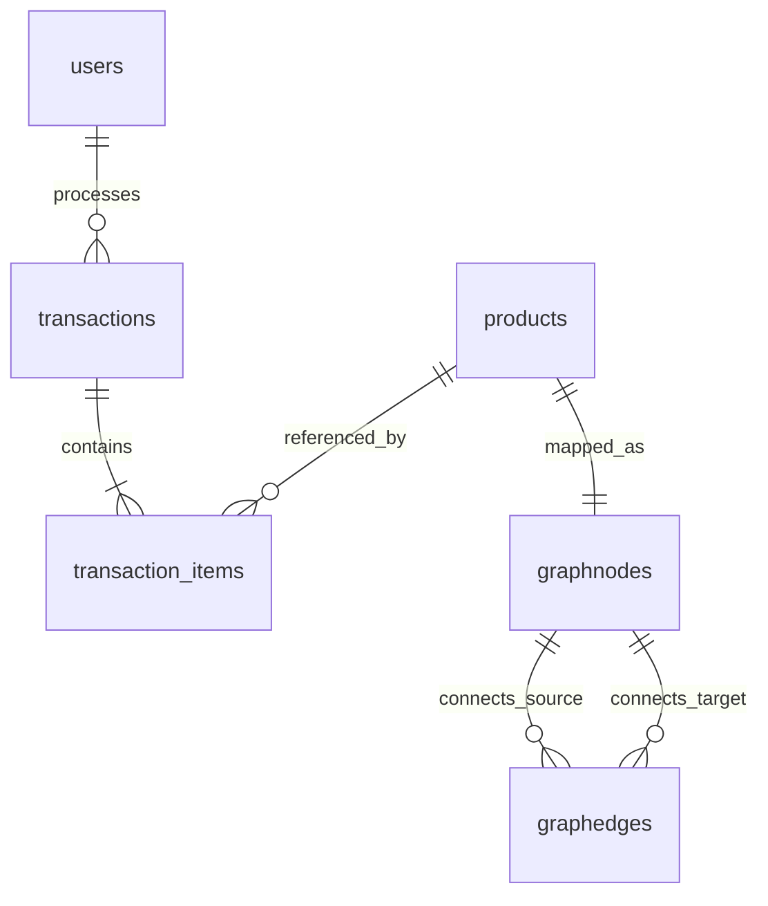

# Database Structure Documentation

This directory contains details about the Xona POS database architecture, schemas, collections, field types, and indexing models. 

---

## 🗃️ MongoDB Collections & Schemas

The application connects to MongoDB (via Mongoose) and exposes six core collections:

### 1. `users` (Cashiers & Administrators)
Stores user registry details for POS authentication and role-based permissions access.

| Field | Type | Required | Description |
| :--- | :--- | :--- | :--- |
| `_id` | `String` | Yes | Unique user identifier. |
| `username` | `String` | Yes | Unique login username (e.g. `admin`, `cashier1`). |
| `passwordHash` | `String` | Yes | Secure blowfish password hash. |
| `email` | `String` | Yes | User email contact address. |
| `role` | `String` | Yes | System permissions privilege level (`admin` or `cashier`). |
| `createdAt` | `String` | Yes | ISO datetime of account creation. |

---

### 2. `products` (Inventory Catalog)
Stores product item details, pricing records, cost, stocks, and sales popularity counts.

| Field | Type | Required | Description |
| :--- | :--- | :--- | :--- |
| `_id` | `String` | Yes | Unique product identifier. |
| `name` | `String` | Yes | Product display title. |
| `sku` | `String` | Yes | Unique stock keeping unit barcode value. |
| `category` | `String` | Yes | Broad department category (e.g. `Beverages`, `Electronics`). |
| `price` | `Number` | Yes | Sale price displayed to customers. |
| `cost` | `Number` | Yes | Supplier unit procurement cost. |
| `stock` | `Number` | Yes | Quantity in inventory storage (defaults to `0`). |
| `description` | `String` | No | Short product description details. |
| `imageUrl` | `String` | No | Image asset URL path. |
| `salesCount` | `Number` | Yes | Total units checked out. |
| `createdAt` | `String` | Yes | ISO datetime of product entry creation. |
| `updatedAt` | `String` | Yes | ISO datetime of last product update. |

---

### 3. `transactions` (Invoices & Audits)
Stores finalized checkouts, payment preferences, line-item arrays, taxes, discounts, and audit statuses.

| Field | Type | Required | Description |
| :--- | :--- | :--- | :--- |
| `_id` | `String` | Yes | Unique transaction receipt ID. |
| `cashierId` | `String` | Yes | Link to the cashier user ID who processed checkout. |
| `items` | `Array` | Yes | Nested array of `TransactionItem` structures (see below). |
| `subtotal` | `Number` | Yes | Gross aggregate amount before tax/discounts. |
| `discount` | `Number` | Yes | Discount amount subtracted from subtotal. |
| `tax` | `Number` | Yes | Sales tax amount computed. |
| `totalAmount` | `Number` | Yes | Net final sum charged to customer. |
| `paymentMethod` | `String` | Yes | Payment selection (`cash`). |
| `paymentStatus` | `String` | Yes | Transaction status (`paid`, `refunded`, `voided`). |
| `createdAt` | `String` | Yes | ISO datetime of checkout processing. |

#### **TransactionItem Sub-Schema**
Each line item contains:
* `productId` (`String`, Required): Link to product.
* `name` (`String`, Required): Snapshot product name during purchase.
* `price` (`Number`, Required): Snapshot product price.
* `quantity` (`Number`, Required): Units ordered.
* `subtotal` (`Number`, Required): `price` $\times$ `quantity`.

---

### 4. `graphnodes` (Recommendation Net Nodes)
Matches products or categories as vertices in the recommendation graph structures.

| Field | Type | Required | Description |
| :--- | :--- | :--- | :--- |
| `_id` | `String` | Yes | Unique node identifier. |
| `type` | `String` | Yes | Class classification (`product` or `category`). |
| `label` | `String` | Yes | Display text string. |
| `metadata` | `Mixed` | No | Custom flexible property objects. |

---

### 5. `graphedges` (Bought-Together Co-occurrences)
Captures connection pathways and increments transaction co-occurrence weights.

| Field | Type | Required | Description |
| :--- | :--- | :--- | :--- |
| `source` | `String` | Yes | Source node ID index. |
| `target` | `String` | Yes | Target node ID index. |
| `type` | `String` | Yes | Connection descriptor (`BOUGHT_WITH` or `BELONGS_TO`). |
| `metadata` | `Mixed` | Yes | Holds the `weight` property (e.g. `{ weight: 5 }` incremented on joint checkouts). |

---

## 💾 Local SQLite Database Tables (`pos_local.db`)

When operating in local/offline mode, the system uses WAL-enabled SQLite (`pos_local.db`):

* `local_users` (`id`, `username`, `passwordHash`, `email`, `role`, `synced`, `createdAt`)
* `local_products` (`id`, `name`, `sku`, `category`, `price`, `cost`, `stock`, `description`, `imageUrl`, `salesCount`, `synced`, `createdAt`, `updatedAt`)
* `local_transactions` (`id`, `cashierId`, `itemsJson`, `subtotal`, `discount`, `tax`, `totalAmount`, `paymentMethod`, `paymentStatus`, `synced`, `createdAt`)
* `local_graph_nodes` (`id`, `type`, `label`, `metadataJson`, `synced`)
* `local_graph_edges` (`id`, `source`, `target`, `type`, `metadataJson`, `synced`)

---

## 📈 Database Schema Relationships

 
* [Production Deployment Guide](./deployments.md)
